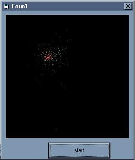



## burning cursor

### Description

simply try this cool effect.

its like the cursor is flaming like a sparkler!
 
### More Info
 

             |
---                |---
**Submitted On**   |2003-08-10 20:00:02
**By**             |[buhhmann](https://github.com/Planet-Source-Code/PSCIndex/blob/master/ByAuthor/buhhmann.md)
**Level**          |Intermediate
**User Rating**    |5.0 (10 globes from 2 users)
**Compatibility**  |VB 4\.0 \(32\-bit\), VB 5\.0, VB 6\.0
**Category**       |[Graphics](https://github.com/Planet-Source-Code/PSCIndex/blob/master/ByCategory/graphics__1-46.md)
**World**          |[Visual Basic](https://github.com/Planet-Source-Code/PSCIndex/blob/master/ByWorld/visual-basic.md)
**Archive File**   |[burning\_cu1627498102003\.zip](https://github.com/Planet-Source-Code/buhhmann-burning-cursor__1-47590/archive/master.zip)

